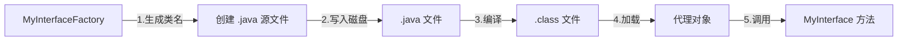

# Dynamic Proxy — Java 动态代理学习项目

本项目通过**两种方式**实现 Java 动态代理，帮助你理解代理模式在运行时的实现原理。

---

## 项目概述

定义一个业务接口 `MyInterface`，包含三个方法 `func1()`、`func2()`、`func3()`。随后分别通过**自定义编译时动态代理**和 **JDK 内置动态代理** 两种方案动态生成该接口的实现类，并在调用方法时附加增强逻辑（如打印方法名、记录日志等）。

---

## 技术栈

| 项目      | 版本     |
| --------- | -------- |
| JDK       | 25       |
| Maven     | 任意版本 |
| 编码      | UTF-8    |

---

## 项目结构

```
src/main/java/com/puppet/proxy/
├── MyInterface.java        # 被代理的业务接口
├── NameAndLengthImpl.java  # MyInterface 的静态实现（供对比）
├── MyHandler.java          # 方法体生成策略接口
├── MyInterfaceFactory.java # 自定义动态代理工厂（生成 .java → 编译 → 加载）
├── Compiler.java           # 封装 javax.tools.JavaCompiler 的编译工具
├── JdkProxy.java           # JDK 动态代理的 InvocationHandler 实现（日志增强）
└── Main.java               # 入口，演示两种代理方式
```

---

## 两种动态代理方案

### 方案一：自定义编译时动态代理

核心思路是在运行时**动态生成 Java 源文件**，然后使用 `javax.tools.JavaCompiler` 将其编译为 `.class` 文件，最后通过类加载器加载并实例化。

**流程：**

1. `MyInterfaceFactory.createProxyObject(handler)` 生成类名 `MyInterface$Proxy1`、`MyInterface$Proxy2`……
2. 调用 `MyHandler.functionBody(methodName)` 获取每个方法的方法体代码（字符串形式）
3. 拼接成一个完整的 `.java` 源文件并写入磁盘
4. `Compiler.compile()` 调用 `javax.tools.JavaCompiler` 编译为 `.class` 文件
5. 通过 `ClassLoader.loadClass()` 加载并反射创建实例



**Handler 示例：**

| Handler          | 效果                               |
| ---------------- | ---------------------------------- |
| `PrintFunctionName` | 每个方法内打印方法名                |
| `LogHandler`        | 在目标方法前后添加 `before/after` 日志（装饰器风格） |

> `LogHandler` 本身还演示了代理嵌套：它的方法体里调用另一个 `MyInterface` 实例，用反射设置依赖，形成类似装饰器的链式调用。

### 方案二：JDK 内置动态代理

使用 `java.lang.reflect.Proxy` 配合 `InvocationHandler`，这是 JDK 官方提供的标准动态代理方案。

**核心类：** `JdkProxy` 实现了 `InvocationHandler`，在 `invoke()` 中为每个方法调用添加了**耗时统计**和**日志输出**：

```
🔔 [LOG] 调用方法: func1, 参数: null
🔔 [LOG] 方法返回: null, 耗时: 0ms
```

---

## 快速运行

```bash
# 确保 JDK 25 已安装
mvn compile exec:java -Dexec.mainClass="com.puppet.proxy.Main"
```

或在 IDE 中直接运行 `Main.main()`。

---

## 运行效果示例

```
func1
func2
func3
------------------------
before
func1
after
before
func2
after
before
func3
after
🔔 [LOG] 调用方法: functionBody, 参数: [jdk]
🔔 [LOG] 方法返回: null, 耗时: 0ms
-----------------------------------
```

---

## 学习要点

- **代理模式**：在不修改原始接口实现的情况下，通过代理对象添加额外行为。
- **编译期 vs 运行时**：自定义方案在运行时生成源码并编译；JDK 方案直接生成字节码。
- **`javax.tools.JavaCompiler`**：Java 提供的程序化编译 API，可在运行时编译任意 Java 源文件。
- **`java.lang.reflect.Proxy`**：JDK 动态代理的标准实现，只能代理接口。
- **装饰器模式**：`LogHandler` 通过持有另一个 `MyInterface` 实例，实现了链式增强。
